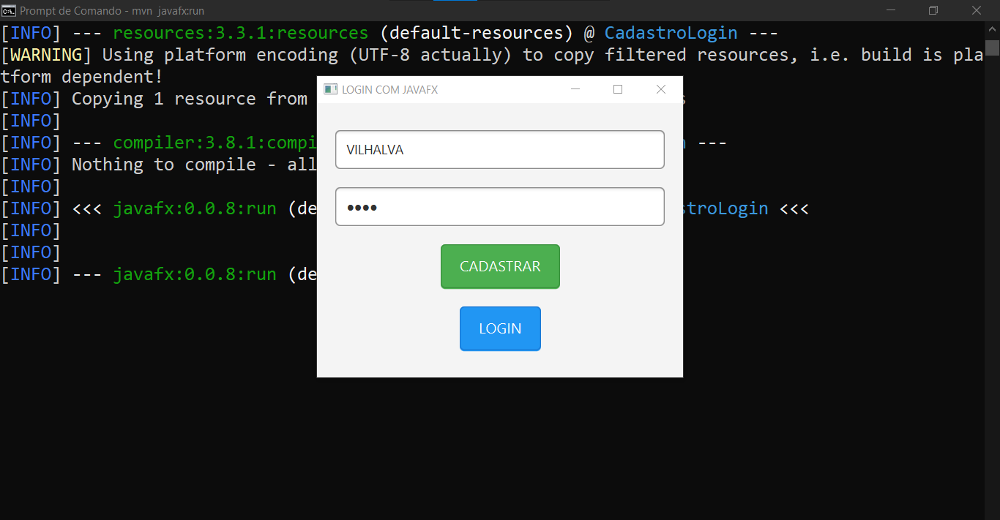
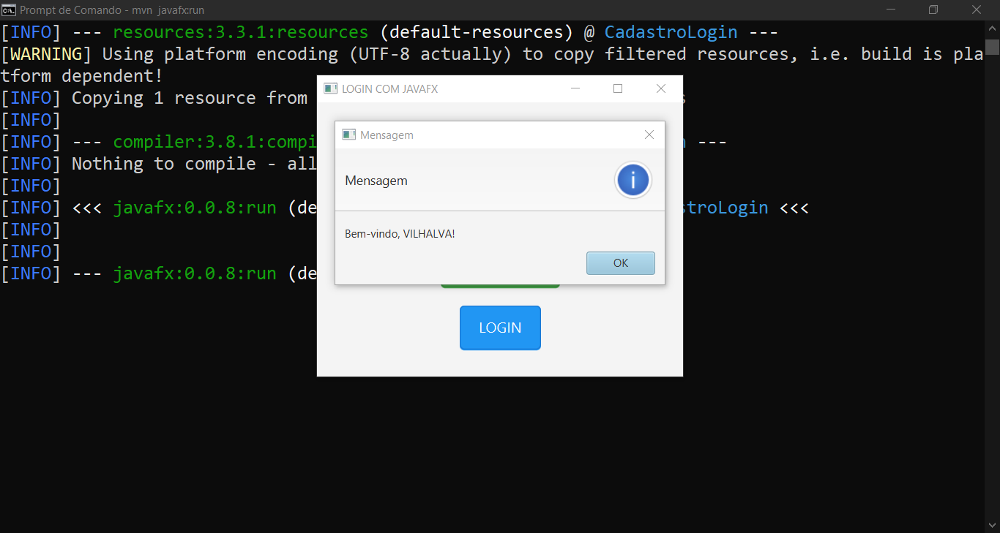
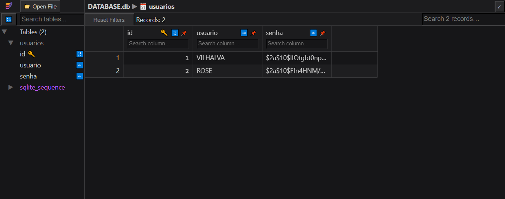

# LOGIN COM JAVAFX
👨‍🏫FORMULARIO DE CADASTRO E LOGIN COM JAVAFX E SQLITE.

 <br>
 <br>
 <br>

## DESCRIÇÃO:
Este aplicativo é uma ferramenta simples de **Cadastro e Login de Usuário** com **armazenamento seguro de senhas** em um banco de dados SQLite. Ele usa a biblioteca `JAVAFX` para a interface gráfica e o `BCrypt` para criptografar as senhas dos usuários.

## RECURSOS:
1. **Cadastro de Usuários**: 
   - O usuário pode se cadastrar informando um nome de usuário e uma senha.
   - A senha é criptografada usando o `BCrypt` para garantir a segurança.
   - O sistema verifica se o usuário já está registrado. Se estiver, exibe uma mensagem informando que o usuário já existe. Caso contrário, o novo usuário é registrado no banco de dados.

2. **Login de Usuários**:
   - O usuário pode fazer login com seu nome de usuário e senha.
   - A senha fornecida é criptografada e comparada com a senha registrada no banco de dados. Se houver uma correspondência, o login é bem-sucedido. Caso contrário, o sistema informa que o usuário ou a senha estão incorretos.

3. **Armazenamento de Dados**:
   - Os dados dos usuários (nome de usuário e senha) são armazenados em um banco de dados SQLite local (`./CODIGO/DATABASE.db`).
   - Se o banco de dados não existir, o app cria automaticamente a tabela `usuarios` no banco de dados.

## FUNCIONAMENTO:
1. **Primeira execução**:
   - Quando o aplicativo é executado pela primeira vez, ele cria automaticamente o banco de dados SQLite (`DATABASE.db`) com a tabela necessária para armazenar os usuários.

2. **Tela principal**:
   - O aplicativo exibe uma janela com os seguintes campos e botões:
     - **Campo de entrada "SEU USUÁRIO"**: O usuário deve digitar seu nome de usuário.
     - **Campo de entrada "SUA SENHA"**: O usuário deve digitar sua senha (a senha será exibida como asteriscos `*` por segurança).
     - **Botão "CADASTRAR"**: O usuário clica neste botão para criar um novo cadastro. O nome de usuário e a senha são verificados e, se estiverem corretos, a senha será criptografada e armazenada.
     - **Botão "LOGIN"**: O usuário clica neste botão para fazer login. O nome de usuário e a senha fornecida são comparados com os dados armazenados no banco de dados, e uma mensagem é exibida com o resultado do login.

3. **Mensagens**:
   - Caso o usuário tente cadastrar um nome de usuário que já existe, ou se tentar fazer login com um nome de usuário ou senha incorretos, o app exibirá uma mensagem de erro.
   - O app também confirma o sucesso de um cadastro ou login bem-sucedido com mensagens de confirmação.

## EXECUTANDO O PROJETO:
1. **Certifique-se de que o projeto esteja compilado:**
   Antes de executar o projeto, você deve garantir que ele foi compilado corretamente. Navegue até o diretório `./CODIGO`, e use o seguinte comando para compilar:

   ```bash
   mvn clean install
   ```

2. **Executar o projeto:**
   Para executar a aplicação com o Maven, usando a classe principal definida no seu `pom.xml`, use o comando:

   ```bash
   mvn javafx:run
   ```

3. **Cadastro**:
   - Digite um nome de usuário no campo "SEU USUÁRIO".
   - Digite uma senha no campo "SUA SENHA".
   - Clique no botão **"CADASTRAR"**.
   - Se o nome de usuário ainda não estiver registrado, o sistema criará o cadastro e armazenará a senha de forma segura (criptografada).

4. **Login**:
   - Digite o nome de usuário e a senha cadastrada nos campos correspondentes.
   - Clique no botão **"LOGIN"**.
   - Se as credenciais estiverem corretas, o sistema mostrará uma mensagem de boas-vindas. Caso contrário, uma mensagem de erro será exibida.

## TECNOLOGIAS USADAS:
- [LINGUAGEM JAVA:](https://github.com/VILHALVA/CURSO-DE-JAVA) A linguagem de programação Java é amplamente utilizada para o desenvolvimento de aplicativos devido à sua portabilidade, segurança e robustez. Ela é uma escolha popular para desenvolver aplicativos desktop, web e móveis.

- [JAVAFX:](https://github.com/VILHALVA/CURSO-DE-JAVAFX) JavaFX é uma Bíblioteca (plataforma) de desenvolvimento rica para criar aplicações gráficas (GUI) modernas e sofisticadas em Java. Ele é projetado para substituir o Swing como a principal biblioteca para GUIs no Java. JavaFX oferece uma ampla gama de recursos que tornam o desenvolvimento mais intuitivo, flexível e visualmente atraente. 

- [SQLITE:](https://github.com/VILHALVA/CURSO-DE-SQLITE) **SQLite** é um sistema de gerenciamento de banco de dados relacional (RDBMS) que se destaca por ser "self-contained", "serverless", "zero-configuration" e por ocupar um espaço mínimo em disco. Desenvolvido por D. Richard Hipp em 2000, o SQLite foi projetado para ser embutido diretamente em programas em vez de funcionar como um serviço separado, como muitos outros sistemas de banco de dados. 

## CREDITOS:
- [PROJETO BASEADO NO "LOGIN COM CUSTOMTKINTER"](https://github.com/VILHALVA/LOGIN-COM-CUSTOMTKINTER)
- [PROJETO FEITO PELO VILHALVA](https://github.com/VILHALVA)


